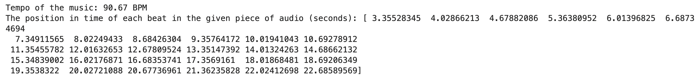
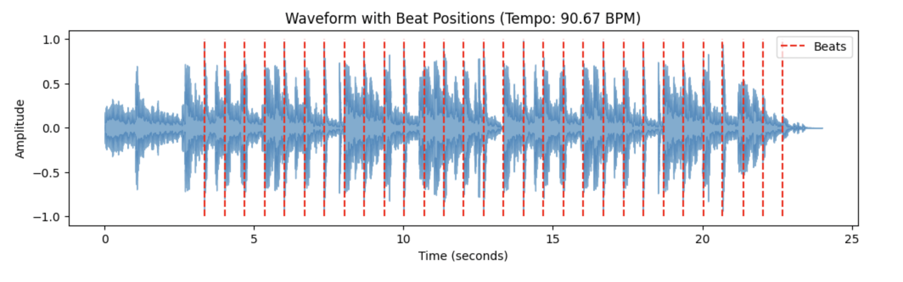
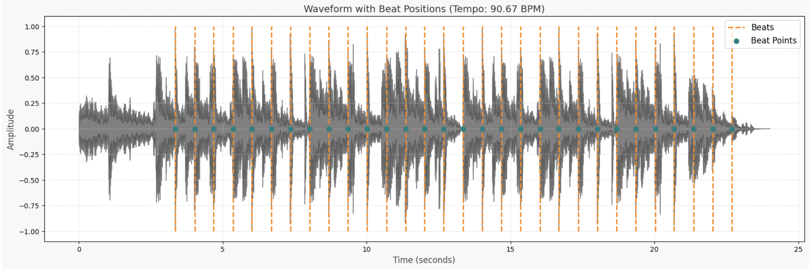
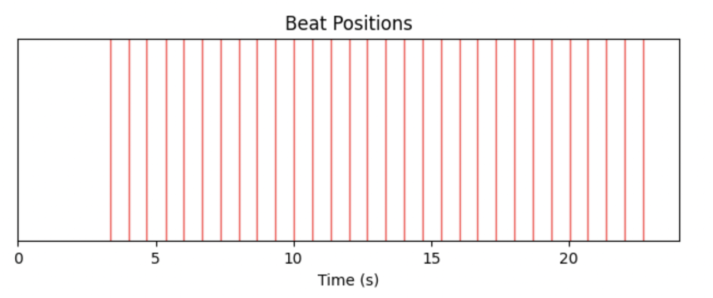
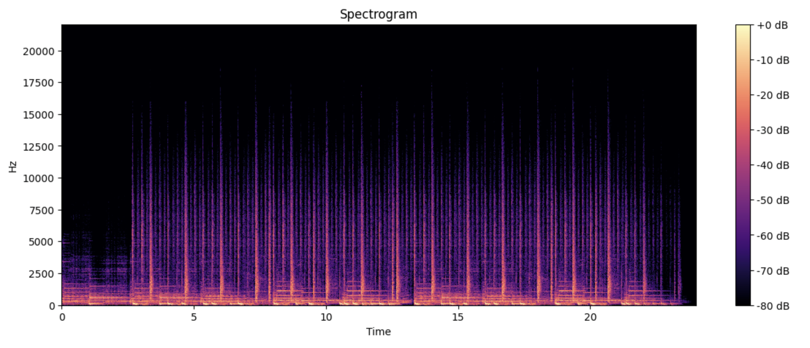
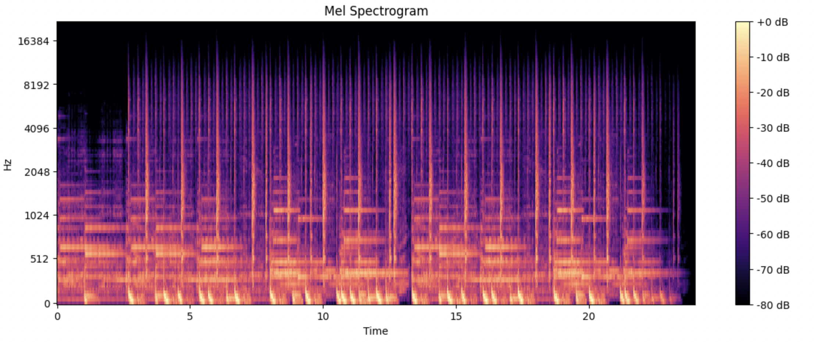
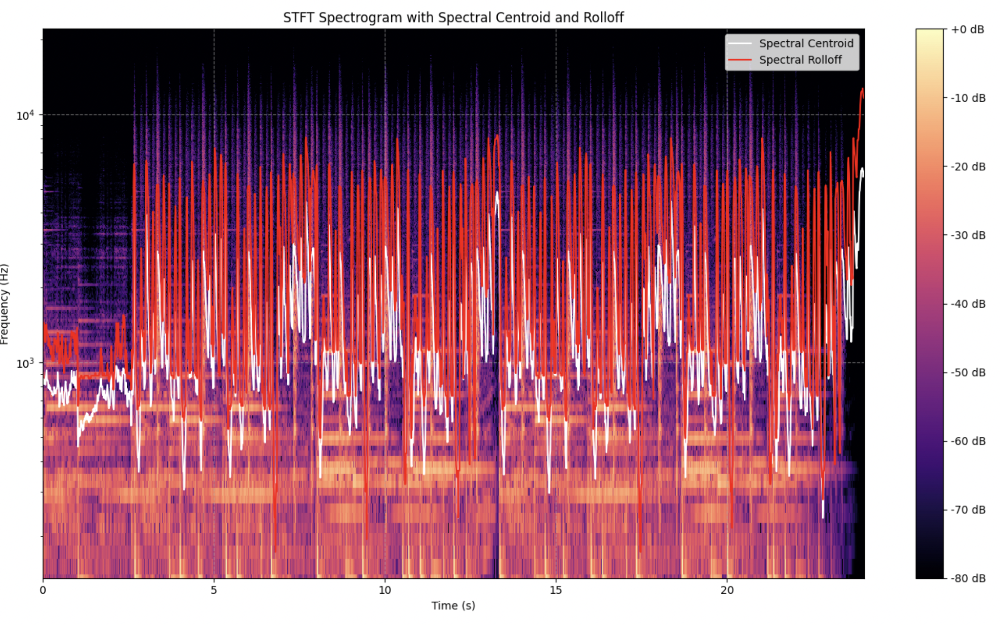
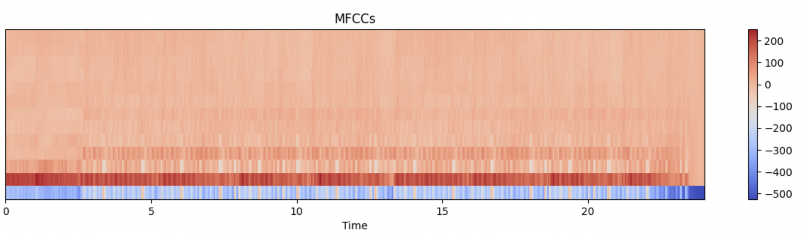
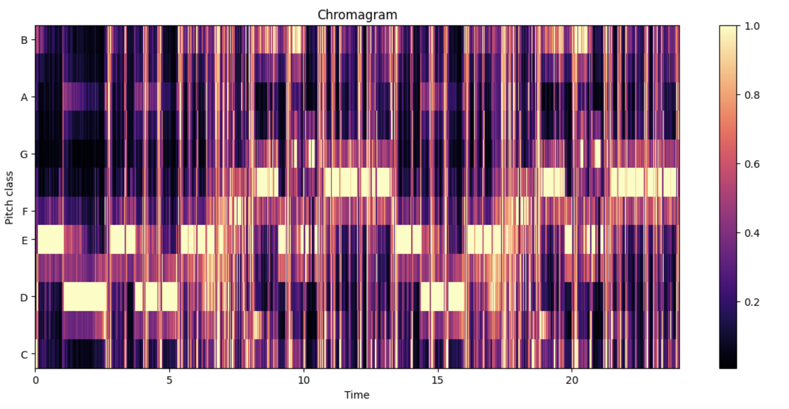
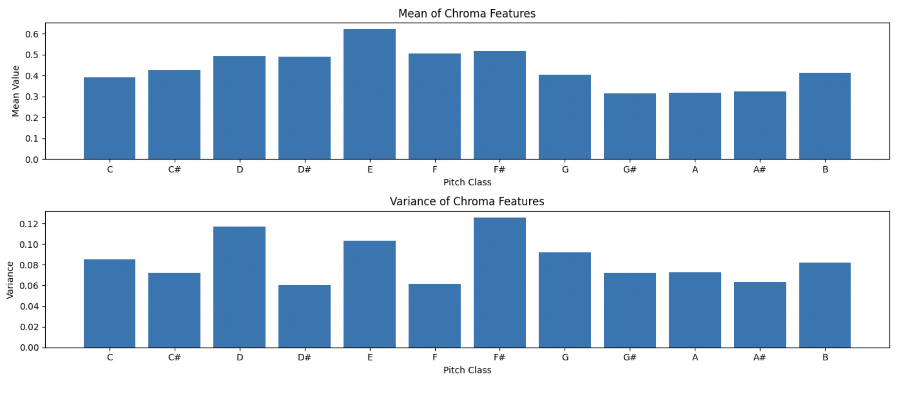

# 🎵 Audio Analysis

## 🎯 Objective
- Beat Tracking – Identifying the beats in a track.
- Tempo Estimation – Determining the speed of the music (BPM).
- Musical Structure Analysis – Understanding the overall composition.
- Pattern Recognition – Detecting rhythmic and melodic patterns.
- Genre Classification – Categorizing music based on its features.
- Key & Chord Detection – Discovering the song's musical keys and chord progressions.
- Mood Identification – Analyzing the emotional tone of the song.

### Install the libraries- Librosa, Numpy, Matplotlib
```bash
pip install librosa matplotlib numpy jupyter
```

### This notebook has mainly divided into two parts. 

First is where we do the mandatory objectives mentioned in the test document. It includes researching about the suitable library, converting audio to a format which can be read and analysed by library. Estimating tempo, beat positions and its visualization in different ways. Here are the results-




Second is where we do spectral analysis to understand frequency distributions, identify patterns, classify genres, pitch classification.





